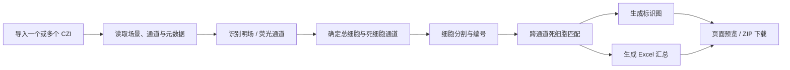

[README.md](https://github.com/user-attachments/files/30850188/README.md)
<div align="center">

# CellCounter

### Zeiss CZI 自动细胞计数工具

批量读取蔡司 `.czi` 显微图像，自动识别荧光通道、分割细胞并统计所有细胞与死细胞，最后生成标识图和 Excel 汇总报告。


</div>


## 功能亮点

| | 功能 | 说明 |
| --- | --- | --- |
| 📂 | 批量导入 | 支持多选 CZI、选择整个文件夹、拖放文件以及粘贴本地路径 |
| 🔬 | CZI 原生读取 | 读取场景、通道图像和通道元数据，无需先转换为 TIFF/JPEG |
| 🧭 | 自动通道识别 | 结合通道名称、染料信息与图像特征区分明场和荧光通道，并自动推断总细胞/死细胞角色 |
| 🧫 | 细胞分割与匹配 | 分割相邻细胞，并将死细胞染色信号与总细胞对象进行一对一匹配 |
| 🖼️ | 可视化标注 | 为每个 CZI 生成所有细胞与死细胞两张编号标识图，便于人工复核 |
| 📊 | 一键汇总 | 一个批次生成一份 Excel 汇总，同时支持将所有结果打包为 ZIP 下载 |

## 工作流程



> 明场图像用于通道判断与参考展示，当前计数流程只处理黑底亮点型荧光通道。单个荧光通道会被作为总细胞通道，死细胞数记为 0。

## 使用方法

### 1. 导入本批次文件

启动程序后，可以选择多个 `.czi` 文件、选择包含 CZI 的文件夹，或将文件直接拖入页面。通过“粘贴路径”还可以递归扫描本地文件夹。

程序会按文件名自然排序，例如 `sample-2.czi` 会排在 `sample-10.czi` 前面。

### 2. 检查识别结果

导入完成后，页面会列出文件、场景、通道缩略图，以及自动识别出的通道类型和染料信息。确认文件顺序与通道预览无误后，点击“开始批量识别计数”。

### 3. 等待批量处理

页面会实时显示已完成文件数。每个 CZI 的不同 Scene 会分别参与计数，同一文件的多个 Scene 会合成为一组结果图。

### 4. 查看并下载结果

完成后可以在页面查看：

- 所有细胞标识图：绿色轮廓表示活细胞，红色轮廓表示匹配到的死细胞；
- 死细胞标识图：在死细胞通道背景上展示匹配后的细胞编号；
- 所有细胞数、死细胞数及页面汇总信息；
- Excel 汇总报告与包含全部输出的 ZIP 压缩包。

<details>
<summary><strong>展开查看 Excel 输出示例</strong></summary>

<br>

<div align="center">
  
</div>

</details>

## 输出文件

Windows 发布版会将结果保存在“文档”目录下：

```text
文档\细胞计数结果\<任务时间>\
├── 样本-01_所有细胞标识图.png
├── 样本-01_死细胞标识图.png
├── 样本-02_所有细胞标识图.png
├── 样本-02_死细胞标识图.png
└── 细胞统计汇总.xlsx
```

从源码运行时，结果保存在项目的 `analysis_results/<任务时间>/` 目录。页面上的“下载全部结果”会将该批次输出打包为 ZIP。

## 人工计数对照


仓库现有验证数据包含 63 组人工计数与程序计数配对结果：

| 指标 | 所有细胞数 | 死细胞数 |
| --- | ---: | ---: |
| 总体加权一致度 | 95.39% | 90.23% |
| 平均绝对误差（MAE） | 9.06 | 2.30 |
| Pearson 相关系数 | 0.910 | 0.976 |

这些数据表示在该批实验图像上的**计数一致程度**，不是通用于所有染色方案、显微镜参数和细胞类型的单细胞分类准确率。首次应用于新的实验条件时，建议抽取一批样本与人工计数进行校准和复核。

## 快速开始

### Windows 发布版

1. 保持 `细胞计数工具.exe` 与 `_internal` 文件夹位于同一目录；
2. 双击 `细胞计数工具.exe`，程序会在默认浏览器中打开操作页面；
3. 使用结束后点击页面右上角“退出程序”。仅关闭浏览器标签页不会结束后台程序。

发布版不需要目标电脑另行安装 Python。

### 从源码运行

```powershell
git clone https://github.com/ho37369-cmyk/zeiss-.git
cd zeiss-

python -m venv .venv
.\.venv\Scripts\Activate.ps1
python -m pip install --upgrade pip
python -m pip install -r requirements.txt
python app.py
```

程序启动后会自动打开 <http://127.0.0.1:51273>。

### 构建 Windows 发布版

```powershell
python -m pip install -r requirements-build.txt
.\构建发布版.bat
```

构建结果位于：

```text
release\细胞计数工具\细胞计数工具.exe
```

## 测试

```powershell
python -m unittest discover -s tests -v
```

当前测试集包含 19 项测试，覆盖通道分类、相邻细胞分割、死细胞匹配、Excel 输出以及批量文件命名等关键行为。

## 技术栈

- [Flask](https://flask.palletsprojects.com/)：本地 Web 界面与任务接口
- [aicspylibczi](https://github.com/AllenCellModeling/aicspylibczi)：Zeiss CZI 文件读取
- [OpenCV](https://opencv.org/) 与 [scikit-image](https://scikit-image.org/)：图像预处理、分割和形态分析
- [NumPy](https://numpy.org/) 与 [SciPy](https://scipy.org/)：数值计算
- [openpyxl](https://openpyxl.readthedocs.io/)：Excel 汇总报告生成
- [PyInstaller](https://pyinstaller.org/)：Windows 免安装发布版打包

## 项目结构

```text
.
├── app.py                       # Flask 应用、批处理任务与桌面启动入口
├── cell_counter/
│   ├── czi_reader.py            # CZI 场景、通道和元数据读取
│   ├── channel_classifier.py    # 明场/荧光分类与通道角色推断
│   ├── cell_counter.py          # 细胞检测、分割与计数
│   ├── annotator.py             # 细胞匹配及结果图标注
│   └── excel_writer.py          # 批次 Excel 报告
├── templates/                   # 页面模板
├── static/                      # 前端样式与交互逻辑
├── tests/                       # 自动化测试
├── CellCounter.spec             # PyInstaller 构建配置
└── 构建发布版.bat                # Windows 构建脚本
```

## 使用边界

- 当前输入格式为 Zeiss `.czi`，不直接处理 TIFF、PNG 或 JPEG；
- 当前算法面向荧光细胞图，明场通道不会参与总细胞或死细胞计数；
- 计数效果会受到曝光、信噪比、染色质量、细胞密度和通道配准偏移影响；
- 自动结果应作为定量辅助，对新的细胞类型或成像流程请先进行人工抽样验证；
- 仓库目前未包含许可证文件，使用与分发范围请以仓库所有者后续发布的许可说明为准。

